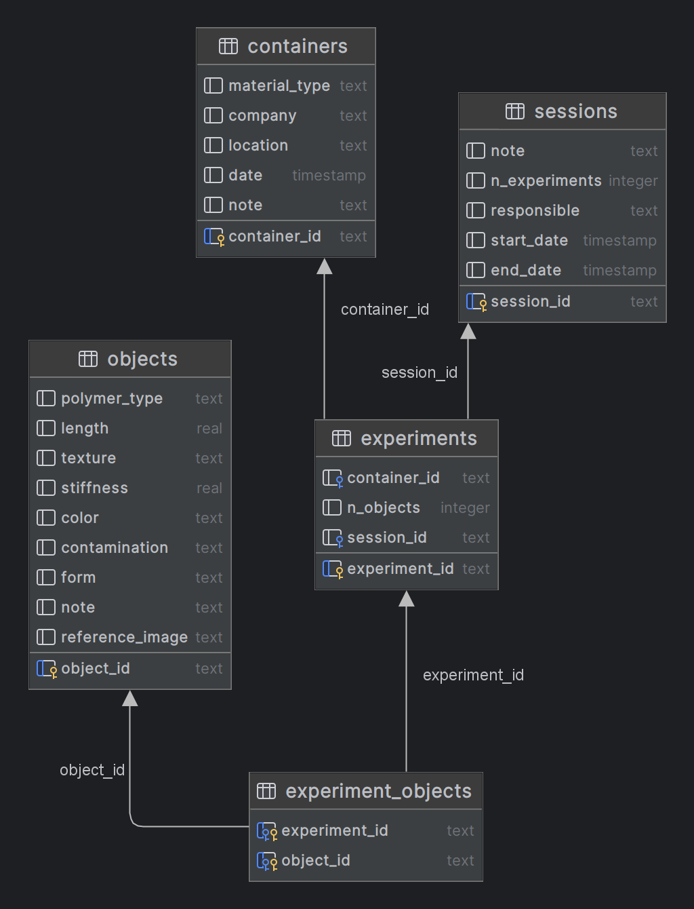

# Experiment Tracker

## Description
This is a simple SQLite database used as an experiment tracker for the Biocycling-Project. 
The database stores information about sessions and the corresponding experiments. 
Multiple objects and one container is assigned to each experiment. 

The relational database consists of the tables `sessions`, `experiments`, `objects`, `containers` and `object_container`.
The table, "containers" has five columns, including "material_type," "container_id," "company," "location," and "note." 
It records details related to the content of containers used in the experiments such as their material type, 
unique container ID, the company that produced them, location, and any additional notes.

The table, "objects," has nine columns, including "object_id," "polymer_type," "length," "texture," "stiffness," "color," 
"contamination," "form," and "note." This table records details related to the foreign objects used in the experiments, 
such as their unique object ID, polymer type, length, texture, stiffness, color, any contamination present, form, and additional notes.

The table, "sessions," has five columns, including "note," "n_experiments," "responsible," "start_date," and "end_date." 
It records details related to the experimental sessions such as any notes, the number of experiments conducted, 
the person responsible, and the start and end dates of the session.

The table, "experiments," has four columns, including "experiment_id," "container_id," "n_objects," 
and "session_id." It records details related to each experiment such as the experiment ID, 
the container ID used in the experiment, the number of objects used in the experiment, a
nd the session ID during which the experiment was conducted.

The table, "experiment_objects," has two columns, including "experiment_id" and "object_id." 
It acts as a bridge between the "experiments" and "objects" tables and records the objects 
used in each experiment.

<p align="center">
    
</p>

## Build database

To build the database, run the following command in the terminal:

```bash
python db_builder.py
```

This creates a sqlite database file called "biocylce_tracking.db" in the data folder. 
Make sure that the data folder is in the same directory as the db_builder.py file. 
To change the name or location of the database file, change the `db` variable in the db_builder.py file.

## Add data to database
The jupyter notebook `initial_population.ipynb` can be used to add data to the database. 
Be sure to provide a pandas dataframe with the following structure:

| session_id | experiment_id | container_id | objects            |
| ---------- | ------------- | ------------ | ------------------ |
| S0000      | E0000         | DI_01_b      | [14_1, 2_5]        |
| S0000      | E0001         | CO_01_c      | [13_9, 7_12]       |
| S0000      | E0002         | DI_01_b      | [16_15, 3_12]      |
| S0000      | E0003         | DI_01_b      | [4_9, 12_4]        |

Multiple predefined queries are available in the `db_queries.py` file and can be used outside the above mentioned notebook.

### Create a new session
To create a new session, run the following function:

```python3
import db_queries as db

result = db.put_session(session_id, n_experiments, responsible, start_date, end_date, note)
```
Multiple sessions can be added by providing a pandas dataframe with the columns 'session_id', 'n_experiments', 'note', 'responsible', 'start_date' and 'end_date'
A session ID is automatically generated if none is provided.

```python
import pandas as pd

df = pd.DataFrame(columns=['session_id', 'n_experiments', 'note', 'responsible', 'start_date', 'end_date'],
                  data=[['S0000', 4, 'First session', 'John Doe', '2021-01-01', '2021-01-02'],
                        ['S0001', 2, 'Second session', 'John Doe', '2021-01-03', '2021-01-04']])

result = db.put_multiple_sessions(df)
```

### Create a new experiment
To create a new experiment, run the following function:

```python3
import db_queries as db

result = db.put_experiment(experiment_id, container_id, n_objects, session_id)
```

Or multiple experiments at once by providing a pandas dataframe with the columns 'experiment_id', 'container_id', 'n_objects' and 'session_id'

```python
import pandas as pd

df = pd.DataFrame(columns=['experiment_id', 'container_id', 'n_objects', 'session_id'],
                  data=[['E0000', 'DI_01_b', 2, 'S0000'],
                        ['E0001', 'CO_01_c', 2, 'S0000'],
                        ['E0002', 'DI_01_b', 2, 'S0000'],
                        ['E0003', 'DI_01_b', 2, 'S0000']])

result = db.put_multiple_experiments(df)
```

### Create a new object
To create a new object, run the following function:

```python3
import db_queries as db

result = db.put_object(object_id, polymer_type, length, texture, stiffness, color, contamination, form, note)
```

Or multiple objects at once by providing a pandas dataframe with the columns 'object_id', 'polymer_type', 'length', 'texture', 'stiffness', 'color', 'contamination', 'form' and 'note'

```python
import pandas as pd

df = pd.DataFrame(columns=['object_id', 'polymer_type', 'length', 'texture', 'stiffness', 'color', 'contamination', 'form', 'note'],
                  data=[['1_1', 'PET', 1, 'smooth', 'soft', 'transparent', 'no', 'fiber', ''],
                        ['1_2', 'PET', 1, 'smooth', 'soft', 'transparent', 'no', 'fiber', ''],
                        ['1_3', 'PET', 1, 'smooth', 'soft', 'transparent', 'no', 'fiber', ''],
                        ['1_4', 'PET', 1, 'smooth', 'soft', 'transparent', 'no', 'fiber', '']])

result = db.put_multiple_objects(df)
```

### Create a new container
To create a new container, run the following function:

```python3
import db_queries as db

result = db.put_container(container_id, material_type, company, location, note)
```

Or multiple containers at once by providing a pandas dataframe with the columns 'container_id', 'material_type', 'company', 'location' and 'note'

```python
import pandas as pd

df = pd.DataFrame(columns=['container_id', 'material_type', 'company', 'location', 'note'],
                  data=[['DI_01_b', 'PET', 'Company A', 'Lab 1', ''],
                        ['CO_01_c', 'PET', 'Company B', 'Lab 2', '']])

result = db.put_multiple_containers(df)
```

### Link objects to experiments
An experiment is only completed when objects are linked to it. To link objects to an experiment, run the following function:

```python3
import db_queries as db

experiment_id = 'E0000'
object_ids = ['1_1', '1_2']

result = db.link_experiment_objects(experiment_id, object_ids)
```

This populates the intermediate table "experiment_objects" with the experiment ID and the object IDs. Make sure that both the experiment ID and the object IDs are already present in the database.

## Query database

The script `db_queries.py` contains multiple predefined queries that can be used to query the database.

### Get a complete session
To get a complete session, i.e. get all experiments associated with a session run the following function:

```python3
import db_queries as db

session_id = 'S0000'

result = db.get_complete_session(session_id)
```
This returns a list of tuples in the shape of `[(session_id, experiment_id, container_id, [object_list]), ...]`

### Get a complete experiment
To get a complete experiment, i.e. get all objects associated with an experiment run the following function:

```python3
import db_queries as db

experiment_id = 'E0000'

result =  db.get_complete_experiment(experiment_id)
```

This returns a list of tuples in the shape of `[(experiment_id, container_id, [object_list]), ...]`

### Get a single object, container, session or experiment
To get a single object, container, session or experiment, run the following function:

```python3
import db_queries as db

result = db.get_object(object_id)
result = db.get_container(container_id)
result = db.get_session(session_id)
result = db.get_experiment(experiment_id)
```


### Run an arbitrary query
To run an arbitrary query, use the following function:

```python3
import db_queries as db

query = 'SELECT * FROM objects'

result = db.run_query(query)
```
This runs any query on the db and returns the result as a list of tuples.


## Delete from database
The database is not protected in any way. To run a delete query, use the `run_query()` function with a query of your choice.
    
```python3
import db_queries as db

query = 'DELETE FROM objects WHERE object_id = "1_1"'
result = db.run_query(query)
```

## Create a set of experiments.
Follow the steps in the `create_experiments.ipynb` notebook to create a set of experiments.

## Other functionality

### Getter functions

#### Get next id
To get the next id for a session or an experiment run either of the following functions:

```python3
import db_builder as db

session_id = db.get_next_session_id()
experiment_id = db.get_next_experiment_id()
```

### Create jsons for capture software 
To create jsons for the capture software, follow the steps in the `get_data_jsons.ipynb`notebook.

## Contact

The live database is managed by [Roman Studer](roman.studer@fhnw.ch). Please contact him for any questions or issues.
